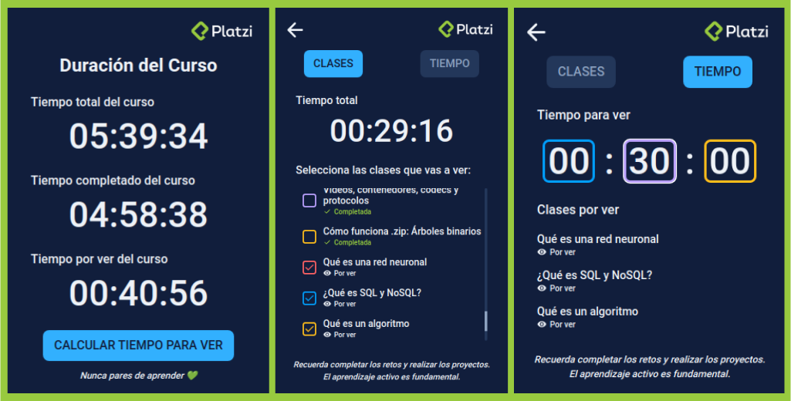

# **Platzi Time Calculator**

This is a plugin from chromium-based web browsers. This plugin let you know the total time from a Platzi course, the time you've already watched and the time left. You will be able to see how much time will take to see some lessons or input the time you want to study and see what are the lessons you are going to watch.

## **Features**

- Show total time, watched time and unwatched time of a Platzi course.
- Calculate the time of certain lessons in a course.
- Calculate the lessons you will watch in certain time.

## **Installation**

For installation you can read the chrome developer documentation for [loading an unpacked extension](https://developer.chrome.com/docs/extensions/mv3/getstarted/development-basics/#load-unpacked).

## **Built with**

Technologies used in the project:

- JavaScript
- CSS3
- HTML5

## **Resources**

Some useful resources used in the project are:

- [Chrome Developers Documentation](https://developer.chrome.com/docs/extensions/)
- [Facil: Crear extension para chrome con Javascript Vanilla - Que modifica cualquier pagina](https://www.youtube.com/watch?v=HBsdL0Hqebs)

## **License**

> This project is licensed under the MIT License

## **Author**

Made with 💚 by [rodruxdev](https://rodrux.com)
